The Chatter Feed allows authorized users to communicate about an object. Object Actions provide a way to quickly 
access common tasks related to an object. In this module, you enable the Chatter Feed for the Expense 
object, and you create an Object Action that lets the user attach a receipt to an expense.

## Step 1: Enable Feed Tracking 

1. In Setup, select **Customize** > **Chatter** > **Feed Tracking**

1. Select the **Expense** object, and check **Enable Feed Tracking**

    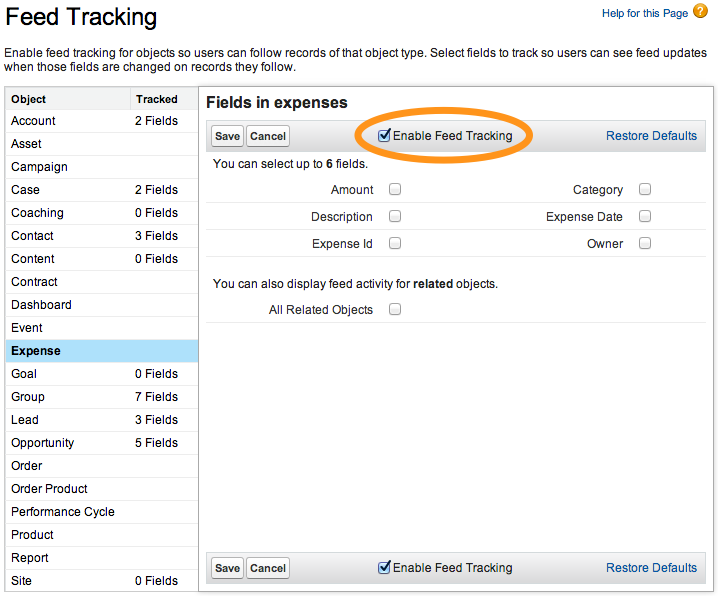 

1. Click **Save**

## Step 2: Modify the Publisher Actions Layout

1. In Setup, select **Build** > **Create** > **Objects** and click the **Expense** link

1. In the **Page Layouts** section, click the **Edit** link to the left of **Expense Mobile Layout**

1. In the **Publisher Actions** section, click the **override the global publisher layout** link.

    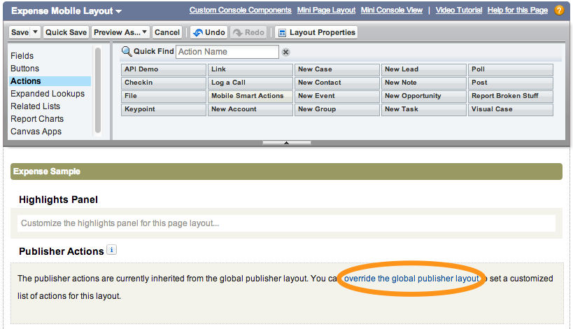 

1. Examine the Publisher Actions and note that the File action is present by default 

    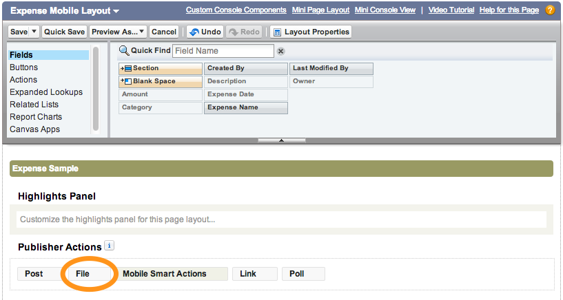 

1. Click **Save** (upper left)

## Step 3: Test the Application

1. Tap the menu icon  (upper left corner)
 
1. In the menu, tap **Expenses** under **Recent**

1. Tap an expense in the list

1. Tap the publisher button  (lower right corner)

1. Tap **File**

    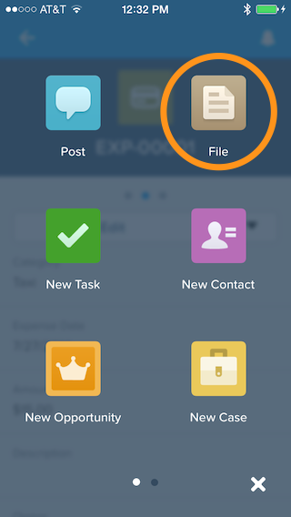 

1. Attach an image
    - If you are running the application on a device, attach an image using **Use Latest Photo**, **Take Photo** or **Pick from Camera 
    Roll** 
    
        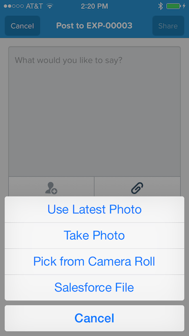 
    - If you are running the application in the Salesforce1 emulator, attach an image using **Upload a file from device**

1. Add an optional comment and click **Share**
    
    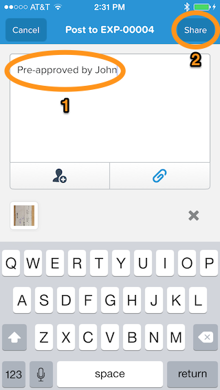

1. On the Expense Report details screen, swipe right to reveal the Chatter Feed for this expense. You should see the 
image attachment. 

    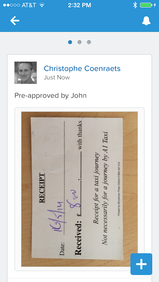 

    >The Chatter Feed automatically allows you and authorized users to communicate about this expense if needed.

## Step 4: Add a Related List to the Page Layout

Another way to look at the receipts for an expense is to add the **Notes & Attachments** list to the Expense 
Mobile Layout:

1. In Setup, select **Build** > **Create** > **Objects** and click the **Expense** link

1. In the **Page Layouts** section, click the **Edit** link to the left of **Expense Mobile Layout**

1. Click **Related Lists**, drag **Notes & Attachments** to the Related Lists section, and click **Save**

    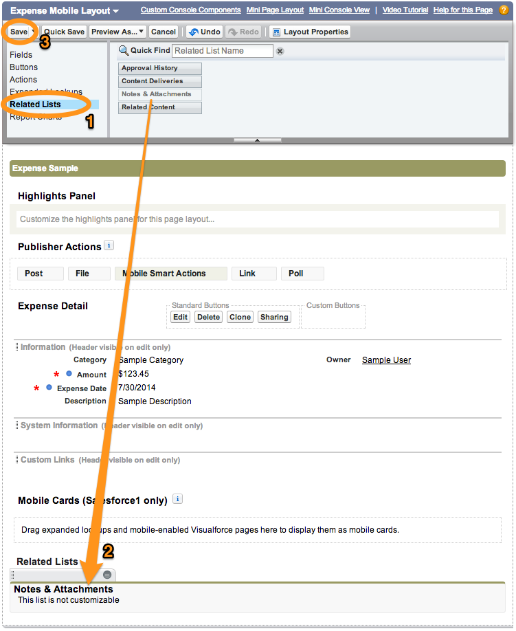 

1. In the Salesforce1 app, go back to the Expense details view and swipe left to reveal the related information 
view

    > If the Notes & Attachments option doesn't appear, pull (swipe down and release) the view to refresh it.

    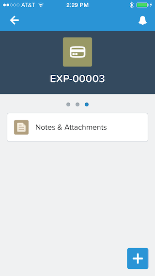 

1. Tap **Notes & Attachments** to reveal the list of attachments

    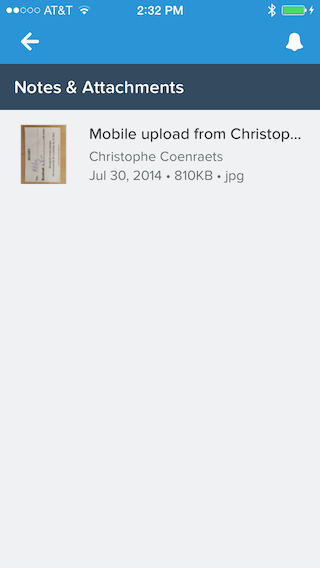 

1. Tap the file you just attached to see it in the image viewer

    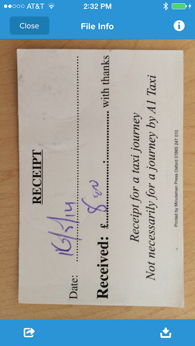 

1. Tap the **Close** button (upper left)

<a href="create-compact-layout.html" class="btn btn-default"><i class="glyphicon glyphicon-chevron-left"></i> Previous</a>
<a href="create-global-action.html" class="btn btn-default pull-right">Next <i class="glyphicon glyphicon-chevron-right"></i></a>

