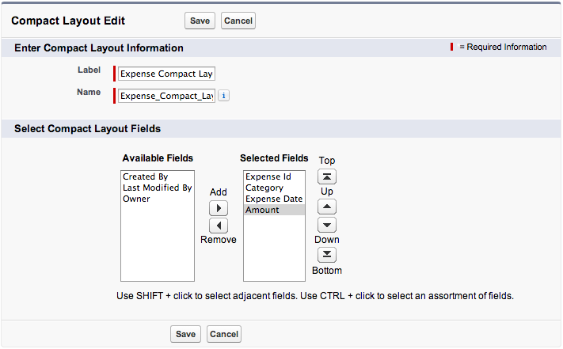

Compact layouts are used to display the key fields of a record whenever a summary representation of the record is 
needed. In this module, you create a compact layout for the expense object.

## Step 1: Create a Compact Layout

1. In **Setup** mode, select **Build** > **Create** > **Objects**

1. Click the **Expense** link

1. In the **Compact Layouts** section, click the **New** button

1. For **Label**, specify **Expense Compact Layout**

1. For **Name**, keep the generated value **Expense&#95;Compact_Layout**
 
1. Add **Expense Id**, **Category**, **Expense Date**, and **Amount** to the **Selected Fields** list 

    

1. Click **Save**

## Step 2: Assign the Default Compact Layout

1. Click the **Compact Layout Assignment** button

1. Click the **Edit Assignment** button

1. In the **Primary Compact Layout** dropdown list, select **Expense Compact Layout**

    

1. Click **Save**

## Step 3: Test the Application

1. In the Salesforce1 mobile app, tap the menu icon  (upper left corner)
 
1. In the menu, tap **Expenses** under **Recent**
 
1. Tap an expense in the list to see the details. Notice that the Record Highlights section displays the four fields 
you selected in the compact layout.
 
    > If you don't see the summary fields in the Records Highlights section, pull (swipe down and release) the view to 
    refresh it.  
 
    

<a href="create-mobile-layout.html" class="btn btn-default"><i class="glyphicon glyphicon-chevron-left"></i> Previous</a>
<a href="create-global-action.html" class="btn btn-default pull-right">Next <i class="glyphicon glyphicon-chevron-right"></i></a>

