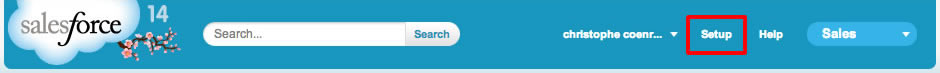
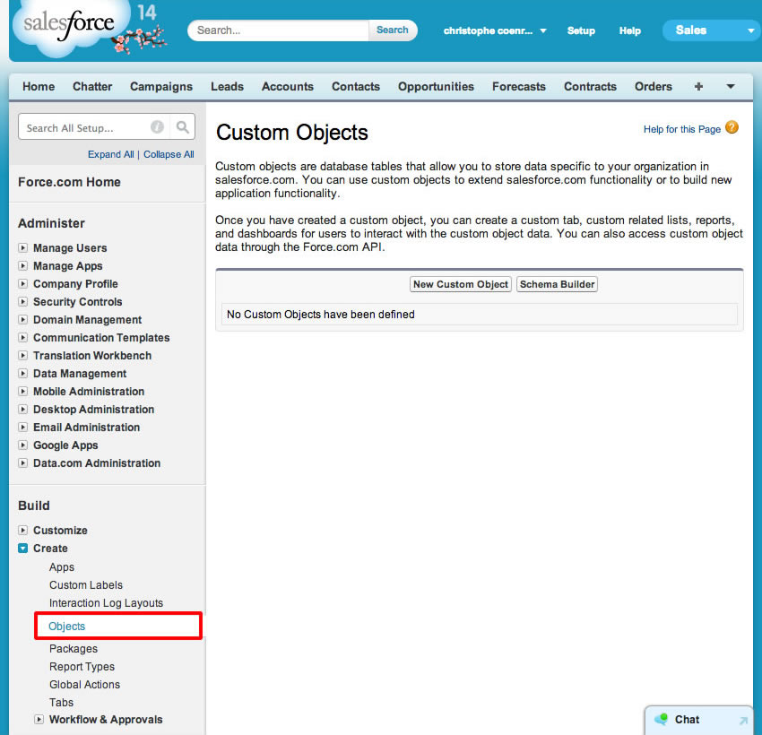
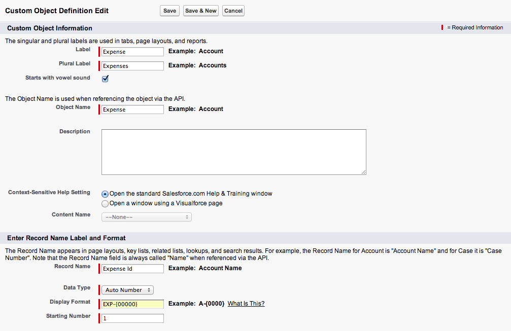
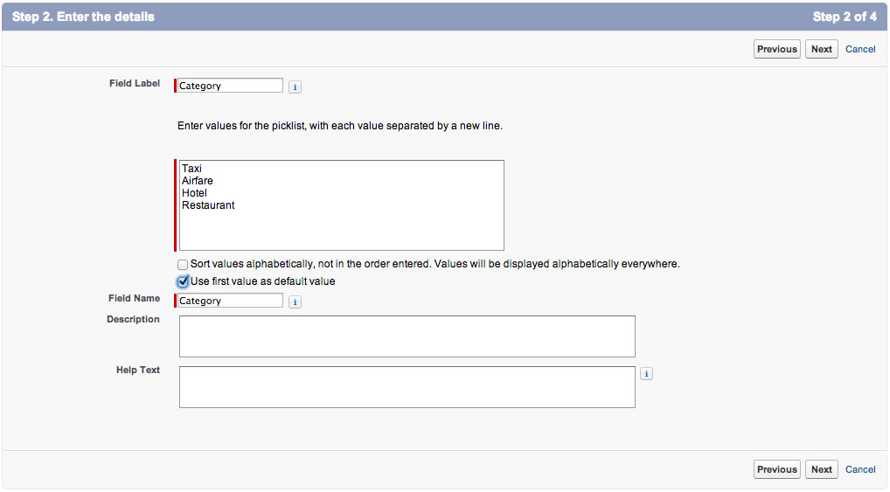

In this module, you create the Expense object used to track expenses.

## Step 1: Create the Expense Object

1. Login into your Developer Edition account

1. Click the **Setup** link (upper right corner)

  

1. In the left navigation, select **Build** > **Create** > **Objects**

  

1. Click **New Custom Object**, and define the Expense object as follows (accept the default values for the properties 
that are not mentioned below):
  - Label: **Expense**
  - Plural Label: **Expenses**
  - Starts with vowel sound: **Checked**
  - Object Name: **Expense**
  - Record Name: **Expense Id**
  - Data Type: **Auto Number**
  - Display Format: **EXP-{00000}**
  - Starting Number: **1**

  

1. Click **Save**

## Step 2: Create Custom Fields

1. In the **Custom Fields & Relationships** section, click **New**, and create a **Category** field defined as follows:
  - Data Type: **Picklist**
  - Field Label: **Category**
  - Values: **Taxi**, **Airfare**, **Hotel**, **Restaurant** (specify each value on its own row)
  - Use first value as default value: **Checked**
  - Field Name: **Category**

  

  Click **Next**, **Next**, **Save & New**

1. Create an **Expense Date** field defined as follows:
  - Data Type: **Date**
  - Field Label: **Expense Date**
  - Field Name: **Expense_Date**
  - Required: **Checked**

  Click **Next**, **Next**, **Save & New**

1. Create an **Amount** field defined as follows:
  - Data Type: **Currency**
  - Field Label: **Amount**
  - Length: **5**
  - Decimal Places: **2**
  - Field Name: **Amount**
  - Required: **Checked**

  Click **Next**, **Next**, **Save & New**

1. Create a **Description** field defined as follows:
  - Data Type: **Text Area**
  - Field Label: **Description**
  - Field Name: **Description**

  Click **Next**, **Next**, **Save**

<a href="install-salesforce1-app.html" class="btn btn-default"><i class="glyphicon glyphicon-chevron-left"></i> 
Previous</a>
<a href="create-expenses-tab.html" class="btn btn-default pull-right">Next <i class="glyphicon 
glyphicon-chevron-right"></i></a>

