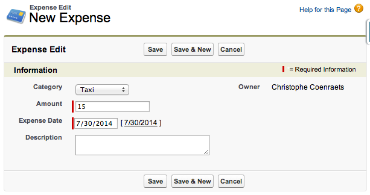

In this module, you create a Tab to provide access to the Expense object both in the Salesforce.com application in your computer's browser and in the Salesforce1 Mobile App. You also create an Application to provide quick access to the Expenses tab while working in the Salesforce.com application in your computer's browser. 

## Step 1: Creating a Tab

1. In **Setup** mode, select **Build** > **Create** > **Tabs**

1. In the **Custom Object Tabs** section, click **New**

1. Select **Expense** as the Object, click the magnifier icon next to Tab Style and select the **Credit card** icon

1. Click **Next**, **Next**

1. Uncheck the **Include Tab** checkbox to ensure the Expenses tab doesn't appear in any of the existing applications (In step 2, you will add the Expenses tab to a new application)

1. Click **Save**

## Step 2: Creating the App

A Salesforce App is a group of Tabs that makes it easy for users to access a set of related features in the 
full Salesforce.com browser app.

> The concept of App as a way to organize Tabs is not used in the Salesforce1 Mobile App.

1. In **Setup** mode, select **Build** > **Create** > **Apps**

1. In the **Apps** section, click **New**

1. Check **Custom app** and click **Next**

1. Enter **Expenses** for both the App Label and App Name, and click **Next**

1. Accept the default App Logo and click **Next**

1. Add the **Expenses** tab to the **Selected Tabs** and click **Next**

1. Check the **Visible** checkbox for the **System Administrator** profile and click **Save**

  

1. Select **Expenses** in the App selector (upper right corner of the screen)

    

  > If the Expenses App doesn't appear in the App Selector, you probably forgot to assign it to the System 
  Administrator profile. In Setup, select Build > Create > App, click Edit next to Expenses, 
  check the System Administrator profile, and click Save.

## Step 3: Enter Sample Data

1. Click the **Expenses Tab**

1. Click **New**

1. Enter a sample expense

    

1. Click **Save**

<a href="create-expense-object.html" class="btn btn-default"><i class="glyphicon glyphicon-chevron-left"></i> 
Previous</a>
<a href="enter-expenses-in-s1.html" class="btn btn-default pull-right">Next <i class="glyphicon 
glyphicon-chevron-right"></i></a>

