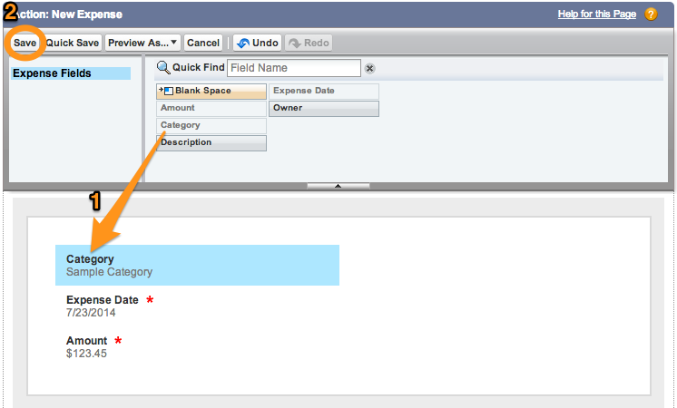

Global actions provide another way to quickly access common tasks. In this module, 
you create a global action that allows the user 
to create a new expense without having to navigate through the menu.

## Step 1: Create the Global Action

1. In **Setup** mode, select **Build** > **Create** > **Global Actions** > **Actions**

1. Click the **New Action** button, and define the action as follows (accept the default values for the properties that 
are not mentioned below):
  - Action Type: **Create a Record**
  - Target Object: **Expense**
  - Standard Label Type: **--None--**
  - Label: **New Expense**
  - Name: **New_Expense**

    

1. Click **Save**

## Step 2: Define the Global Action Page Layout

1. Drag the **Category** field and position it as the first field in the global action page layout

1. Click **Save**

## Step 3: Add the Global Action to the Publisher Layout

1. In **Setup** mode, select **Build** > **Create** > **Global Actions** > **Publisher Layouts**

1. Click the **Edit** link to the left of **Global Layout**

1. Drag the **New Expense** Action 
to the Publisher Actions section (before the **Post** action)

    

1. Click **Save** (upper left) 

## Step 4: Test the Application

1. In the Salesforce1 mobile app, tap the menu icon  (upper left corner)

1. Select **Feed** in the menu

1. Tap the publisher button  (lower right corner)

1. Tap **New Expense**

    

1. Enter a new expense, and click **Submit** (upper right corner)  

<a href="create-compact-layout.html" class="btn btn-default"><i class="glyphicon glyphicon-chevron-left"></i> Previous</a>
<a href="related-objects.html" class="btn btn-default pull-right">Next <i class="glyphicon glyphicon-chevron-right"></i></a>

