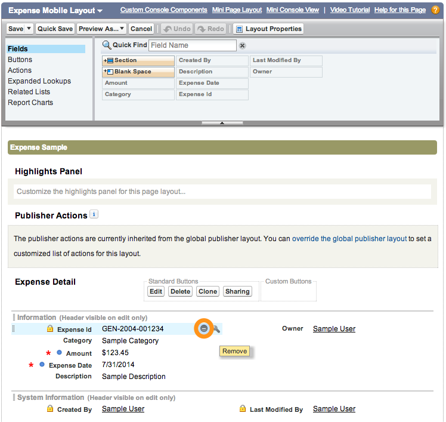
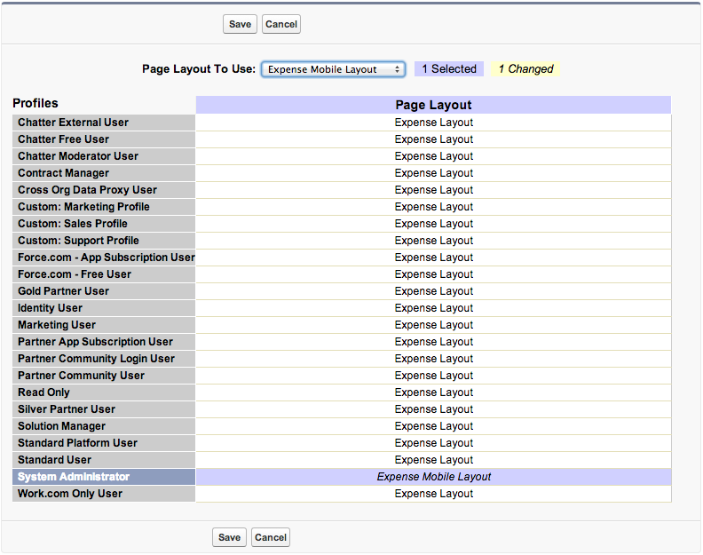
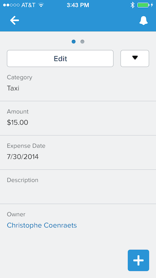

To keep an application usable on a small screen, it is important to avoid clutter and only display the information a 
mobile user really needs. In this module, you create a mobile-optimized layout to display expenses.

## Step 1: Create the Mobile Layout

1. In **Setup** mode, select **Build** > **Create** > **Objects**

1. Click the **Expense** link

1. In the **Page Layouts** section, click the **New** button

1. For **Existing Page Layout**, specify **Expense Layout**

1. For **Page Layout Name**, Specify **Expense Mobile Layout**

1. Click **Save**

## Step 2: Add / Remove Fields

1. Mouse over the **Expense Id** field and click the **Remove** button 

    
 
1. Mouse over the **Created By** field and click the **Remove** button 
 
1. Mouse over the **Last Modified By** field and click the **Remove** button 

1. Click the **Save** button (upper left)

## Step 3: Assign the Page Layout to Specific Users

1. In the **Page Layouts** section, click the **Page Layout Assignment** button

1. Click the **Edit Assignment** button

1. Click **System Administrator** in the list, and select **Expense Mobile Layout** in the **Page 
Layout To Use** dropdown list.

    

1. Click **Save**

## Step 4: Test the Application

1. In the Salesforce1 Mobile App, tap the menu icon  (upper left corner)
 
1. In the menu, tap **Expenses** under **Recent**
 
1. Tap an expense in the list to see the details screen

1. Swipe up to hide the record highlights header

1. Notice that the Expense Id, 
Created By, and Last Modified By fields are no longer displayed
 
    

> In this case, the difference between the two layouts is minimal. Creating a mobile layout makes a lot of sense for 
objects with a lot of 
fields.

<a href="manage-expenses-in-s1.html" class="btn btn-default"><i class="glyphicon glyphicon-chevron-left"></i> Previous</a>
<a href="create-compact-layout.html" class="btn btn-default pull-right">Next <i class="glyphicon glyphicon-chevron-right"></i></a>

