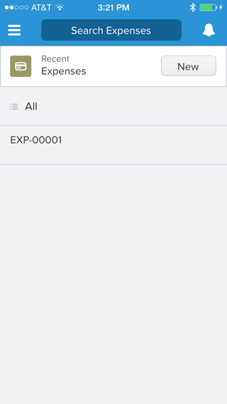
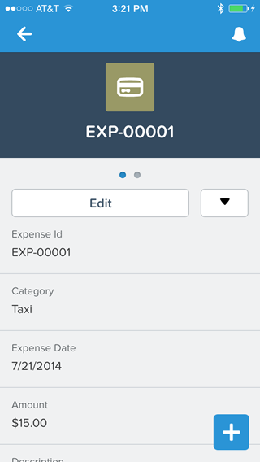
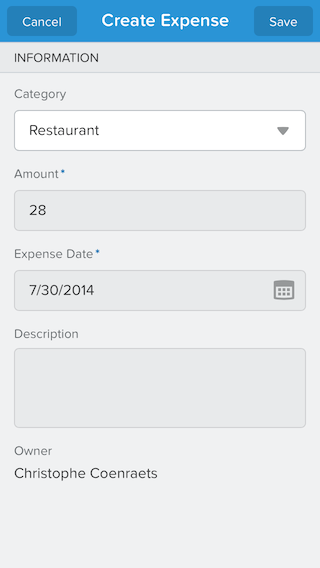
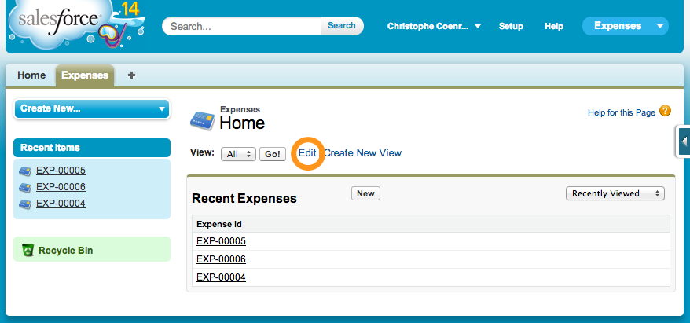
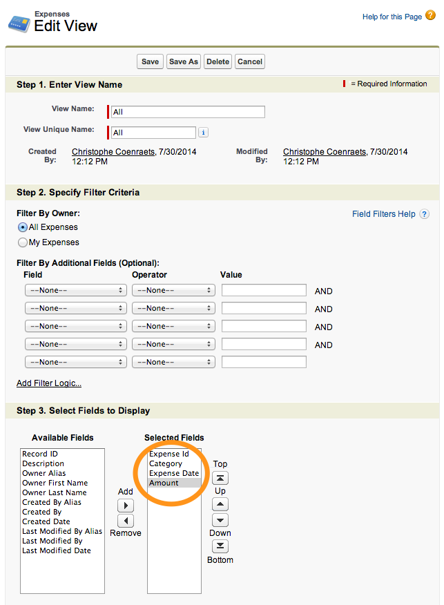
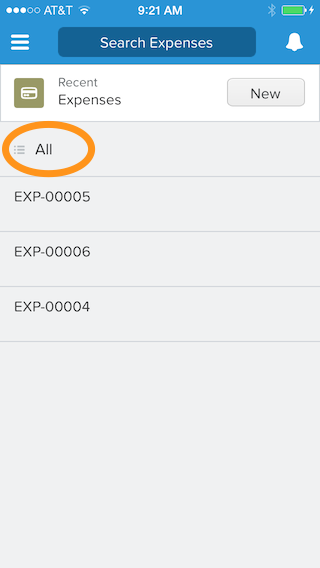
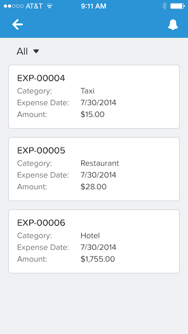
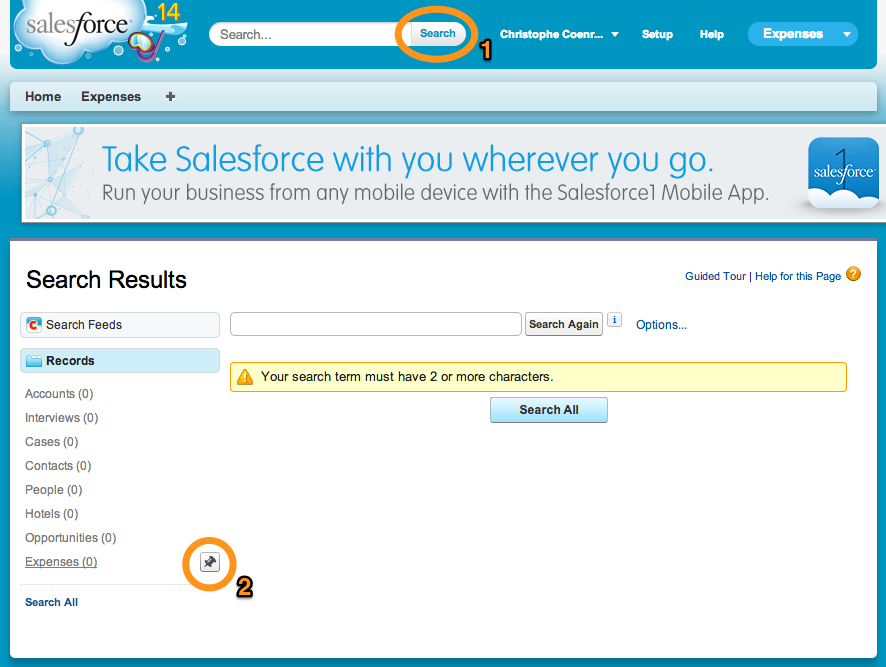
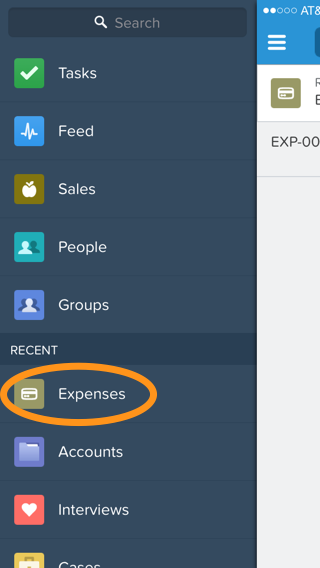

When you create a Tab for an object, the object becomes automatically available in the Salesforce1 Mobile App. In 
this module, you experiment with viewing, creating, and editing expenses in the Salesforce1 Mobile App.

## Step 1: Create an Expense in Salesforce1

1. Open the Salesforce1 app on your mobile device 

    > You can also emulate the Salesforce1 Mobile App in your computer browser as
 explained in [Module 2](install-salesforce1-app.html).

1. Tap the menu icon  (upper left corner)

    > Use **Clicks** instead of **Taps** in the remaining of this tutorial if you are emulating the Salesforce1 Mobile App
     in your computer browser. 
 
1. In the menu, tap **More...** under **Recent**
 
1. Tap **Expenses** to display the expense list

    

1. Tap an expense in the list to display the expense details
 
    

1. Tap the Back button to go back to the expense list
 
1. In the expenses list, tap **New**, and enter a new expense

    
 
1. Tap Save (upper right corner)

## Step 2: Adding Useful Information to the List Views 

1. In the Salesforce.com application in your browser, click the Expenses tab, and click the **Edit** link to edit the **All** view

    
    
1. In the **Select Fields to Display** section, add **Expense Id**, **Category**, **Expense Date**, and **Amount** to the **Selected Fields**, and click **Save**    

    
    
1. In the Salesforce1 Mobile App, go back to the list of expenses and tap **All**
  
  > If you don't see the All option, pull (swipe down and release) the list to refresh it

    

1. The view loads with the fields you specified in the view definition. You can click an expense to see details.
    
    

## Step 3: Pin Expenses at the Top of the List

For faster access, you can pin frequently used items at the top of the **Recent** menu item: you will no longer need 
to go find an object deep under the **More...** item.  

1. In the Salesforce.com application in your browser, click the **Search** button in the header

    > You don't need to type anything in the search box: we just need the Search Results by Records to appear in the 
    left navigation.  

1. In the **Search Results** (left navigation), mouse over **Expenses**, and click the Pin button

1. In the Salesforce1 Mobile App, tap the menu icon  (upper left corner)

1. If **Expenses** doesn't appear as the first item under **Recent**, pull (swipe down and release) the menu to 
refresh it

    

<a href="create-expenses-tab.html" class="btn btn-default"><i class="glyphicon glyphicon-chevron-left"></i> Previous</a>
<a href="create-mobile-layout.html" class="btn btn-default pull-right">Next <i class="glyphicon glyphicon-chevron-right"></i></a>

