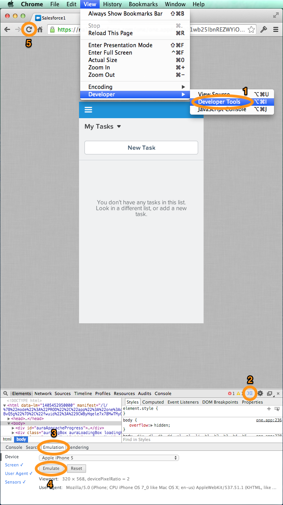

In this module, you install the Salesforce1 Mobile Application on your device.

> If you have already installed Salesforce1 on your device, logout from the application, 
and login again using your credentials for the developer edition you created in [Module 1](developer-edition.html). You can then skip the 
instructions below and go directly to [Module 3](create-expense-object.html).

## Step 1: Install the Salesforce1 Mobile App

> **You don't need a mobile device to complete this tutorial**: You can emulate the Salesforce1 app in your 
computer's browser. Instructions are provided in Step 2 below.

To install the Salesforce1 Mobile App, you need one of the following devices:

- iPhone or iPad with iOS 7 or later
- Android device with Android 4.2 or later 

To Install the Salesforce1 app on a supported device:

1. In the mobile device's browser, open [http://www.salesforce.com/mobile](http://www.salesforce.com/mobile), 
and install the Salesforce1 application for your platform
 
1. Once installed, open the Salesforce1 app

1. Enter your credentials for the Developer Edition you created in [Module 1](developer-edition.html)

    

## Step 2: Emulating the Salesforce1 Mobile App

If you don't have a supported device available, or if you want to quickly test something during development, 
you can also emulate the Salesforce1 app in your computer's browser:

1. Open a browser on your computer

    > Google Chrome is recommended to emulate the Salesforce1 app on your computer

1. Login into your Developer Edition account

1. Modify the URL:
    - Remove the part of the URL that comes immediately after **salesforce.com**
    - Append **/one/one.app** to the URL immediately after **salesforce.com**

    

1. For a more accurate representation of the application on a mobile device, you can also use the new Google Chrome device emulation features.
    - In Chrome, click **View > Developer > Developer Tools**
    - Click the **Show Drawer** button (upper right corner in the Developer Tools panel)
    - Click the **Emulation** tab
    - Select your device and click **Emulate**
    - Refresh the page
    - Click the **Reset** button to stop emulating the device
    
    

<a href="developer-edition.html" class="btn btn-default"><i class="glyphicon glyphicon-chevron-left"></i> Previous</a>
<a href="create-expense-object.html" class="btn btn-default pull-right">Next <i class="glyphicon 
glyphicon-chevron-right"></i></a>

