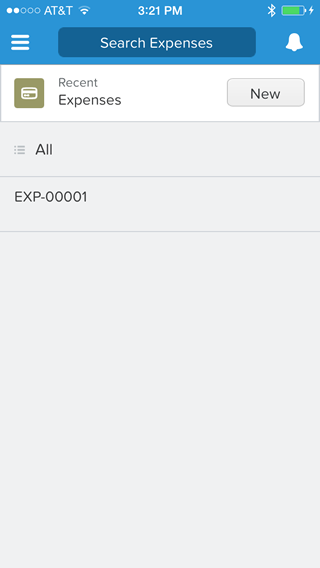
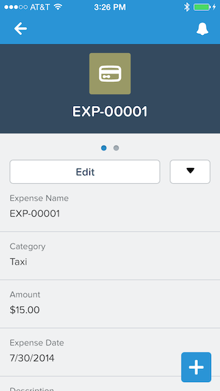
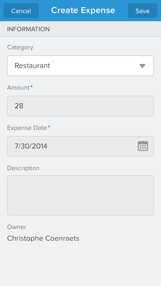

When you create a Tab for an object, that object becomes automatically available in the Salesforce1 Mobile App. In 
this module, you experiment with viewing, creating, and editing expenses in the Salesforce1 Mobile App.
## Steps

1. Open the Salesforce1 app on your mobile device 

    > You can also emaulate the Salesforce1 mobile app in your computer browser as
 explained in [Module 2](install-salesforce1-app.html).

1. Tap the menu icon  (upper left corner)
 
1. In the menu, tap **More...** under **Recent**
 
1. Tap **Expenses** to display the expense list

    

1. Tap an expense in the list to display the expense details screen
 
    

1. Tap the Back button to go back to the expense list
 
1. In the expenses list, tap **New**, and enter a new expense

    
 
1. Tap Save (upper right corner)

<a href="create-expenses-tab.html" class="btn btn-default"><i class="glyphicon glyphicon-chevron-left"></i> Previous</a>
<a href="create-mobile-layout.html" class="btn btn-default pull-right">Next <i class="glyphicon glyphicon-chevron-right"></i></a>

