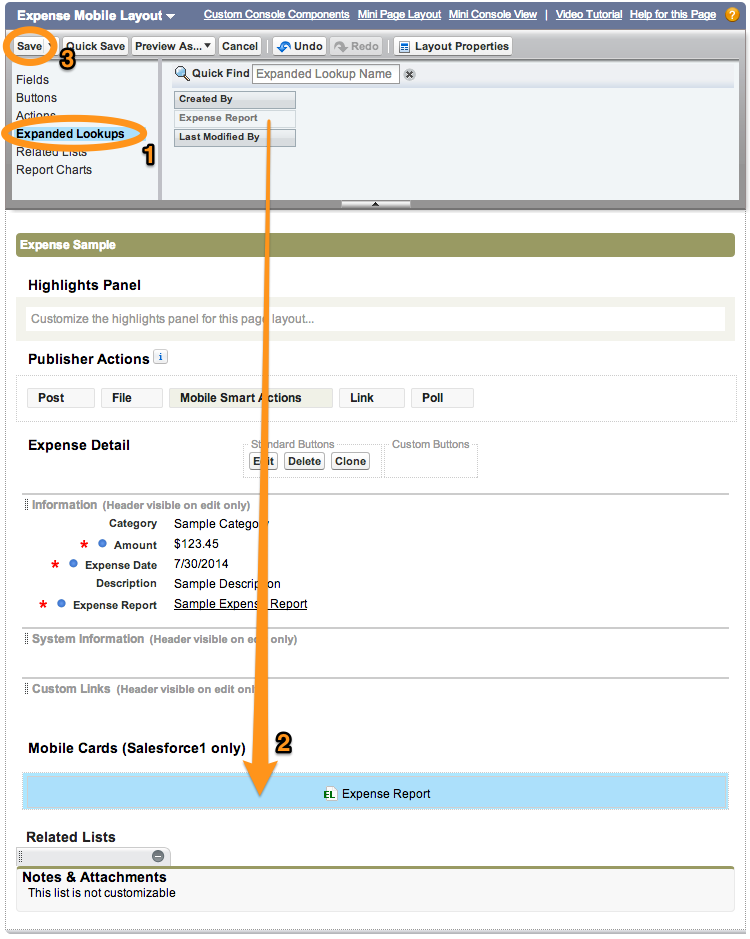
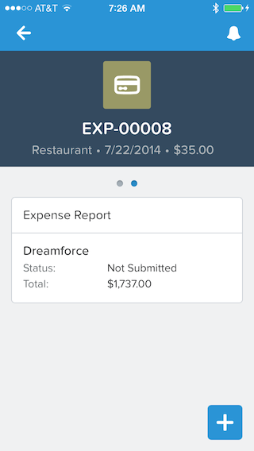

Mobile Cards are useful to display additional information about a record. They appear in the *related information* 
screen that is displayed when you swipe left on a record details view. In this module, 
you add a mobile card to Expense Mobile Layout to display a summary of the parent expense report.

## Step 1: Add the Mobile Card

1. In Setup, select **Build** > **Create** > **Objects**, and click the **Expense** link

1. In the **Page Layouts** section, click **Edit** to the left of **Expense Mobile Layout**

1. Select **Expanded Lookups**, and drag **Expense Report** to the **Mobile Card (Salesforce1 Only)** section

     

1. Click **Save** (upper left)

## Step 2: Test the Application

1. In the Salesforce1 mobile app, access the details view for an expense

1. Swipe left to see the mobile card showing the expense report this expense belongs to.

     

<a href="object-action-update-record.html" class="btn btn-default"><i class="glyphicon glyphicon-chevron-left"></i> Previous</a>
<a href="next.html" class="btn btn-default pull-right">Next <i class="glyphicon glyphicon-chevron-right"></i></a>

