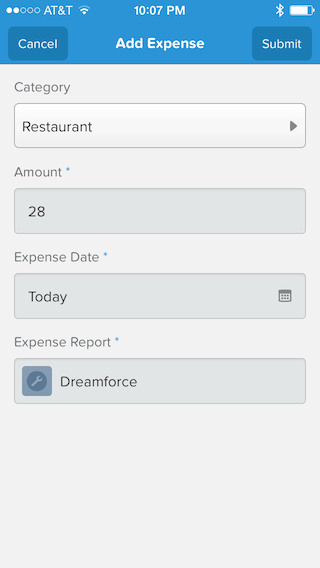

## Step 1: Create the Object Action

1. In Setup, select **Build** > **Create** > **Objects** and click the **Expense Report** link

1. In the **Buttons, Links, and Actions** section, click **New Action**, and define the Action as follows:
  - Action Type: **Create a Record**
  - Target Object: **Expense**
  - Standard Label Type: **--None--**
  - Label: **Add Expense**
  - Name: **Add_Expense**

     

1. Click **Save**

1. Drag the **Category** field to the Layout (before Expense Date)
 
     

1. Click **Save** (upper left) 

## Step 2: Modify the Publisher Actions Layout

1. In Setup, select **Build** > **Create** > **Objects** and click the **Expense Report** link

1. In the **Page Layouts** section, click the **Edit** link to the left of **Expense Report Layout**

1. In the **Publisher Actions** section, click the **override the global publisher layout** link

1. Click **Actions**

1. Drag the **Add Expense** action to the **Publisher Actions** section (before Post)

     

1. Click **Save** (upper left)

## Step 3: Test the Application

1. Tap the menu icon  (upper left corner)
 
1. In the menu, tap **Expense Reports** under **Recent**

1. Tap an expense report in the list

1. Tap the publisher button  (lower right corner)

1. Tap **Add Expense**

     

1. Enter an expense

     

    > Notice that Expense Report is automatically populated.   

1. Click **Submit** (upper right corner)

1. On the Expense Report details screen, swipe left

1. Tap **Expenses**

1. Pull to refresh the list
 

<a href="related-objects.html" class="btn btn-default"><i class="glyphicon glyphicon-chevron-left"></i> Previous</a>
<a href="object-action-update-record.html" class="btn btn-default pull-right">Next <i class="glyphicon glyphicon-chevron-right"></i></a>

