Salesforce1 makes it easy to navigate through related objects. In this module, you create a new Expense Report 
object, and you define a Master-Detail Relationship between Expense Report and Expense. You then use the Salesforce1 
Mobile App to create expenses that belong to an expense report. You can then visualize expenses by expense report, and
 see the expense report total.

## Step 1: Create the Expense Report Object

1. In Setup, select **Build** > **Create** > **Objects**

1. Click **New Custom Object**, and define the Expense Report object as follows (accept the default values for the 
properties that are not mentioned below):
  - Label: **Expense Report**
  - Plural Label: **Expense Reports**
  - Starts with vowel sound: **Checked**
  - Object Name: **Expense_Report**
  - Record Name: **Expense Report Name**
  - Data Type: **Text**

    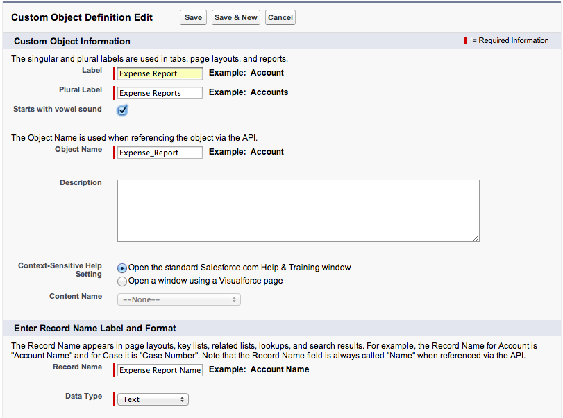

1. Click **Save**

1. In the **Custom Fields & Relationships** section, click **New**, and create a **Status** field defined as follows:
  - Data Type: **Picklist**
  - Field Label: **Status**
  - Values: **Not Submitted**, **Submitted**, **Approved**, **Rejected** (specify each value on its own row)
  - Use first value as default value: **Checked**
  - Field Name: **Status**

    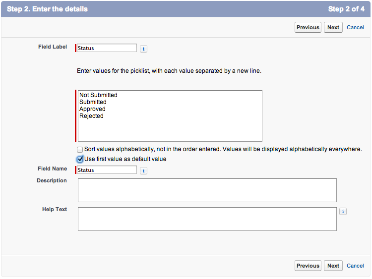

1. Click **Next**, **Next**, **Save**

## Step 2: Define the Master-Detail Relationship

1. In the Salesforce.com app in your browser, **delete all the expenses** to avoid constraint issues

1. In Setup, select **Build** > **Create** > **Objects** and click the **Expense** link

1. In the **Custom Fields & Relationships** section, click **New**, and create an **Expense Report** field defined as 
follows:
  - Data Type: **Master-Detail Relationship**
  - Related To: **Expense Report**
  - Field Label: **Expense Report**
  - Field Name: **Expense_Report**
  - Child Relationship Name: **Expenses**

    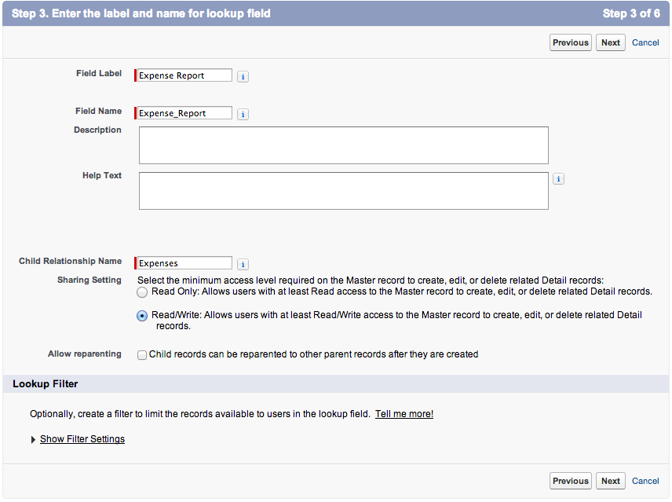

1. Click **Next**, **Next**, **Next**, and **Save**

## Step 3: Define a Roll-Up Summary Field 

To calculate and display the total of each expense report, add a Roll-Up Summary field to the Expense Report object:

1. In Setup, select **Build** > **Create** > **Objects** and click the **Expense Report** link

1. In the **Custom Fields & Relationships** section, click **New**, and create a **Total** field defined as 
follows:
  - Data Type: **Roll-Up Summary**
  - Field Label: **Total**
  - Field Name: **Total**
  - Summarized Object: **Expenses**
  - Roll-Up Type: **SUM**
  - Field to Aggregate: **Amount**

    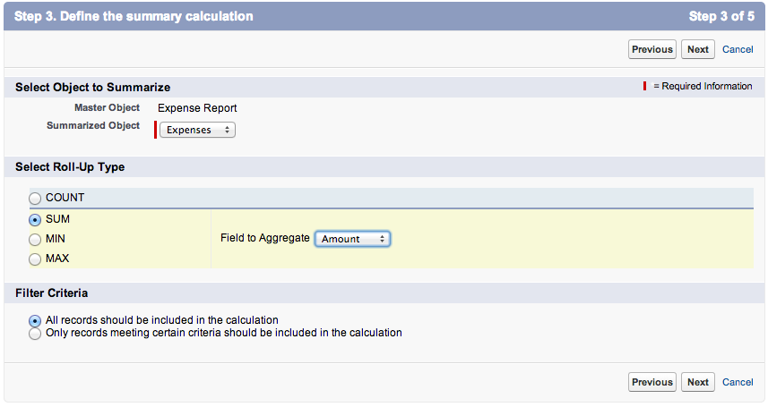 

1. Click **Next**, **Next**, **Save**

## Step 4: Creating a Tab

In this step, you create a Tab to provide access to the **Expense Report** object both in the Salesforce.com app
 in your browser and in the Salesforce1 Mobile App.

1. In **Setup** mode, select **Build** > **Create** > **Tabs**

1. In the **Custom Object Tabs** section, click **New**

1. Select **Expense Report** as the Object, click the magnifier icon next to Tab Style and select the **Airplane** 
icon

1. Click **Next**, **Next**

1. Uncheck the **Include Tab** checkbox, check the **Expenses** checkbox, and click **Save**

## Step 5: Test the Application

1. Tap the menu icon  (upper left corner)
 
1. In the menu, tap **More...** under **Recent**
 
1. Tap **Expense Reports**

    > If **Expense Reports** doesn't appear under **More...**, pull (swipe down and release) the menu to refresh it

1. Tap **New**, and enter a new expense report

    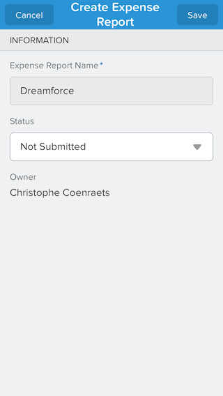
 
1. Click **Save** (upper right corner). The Expense Report details screen appears.

    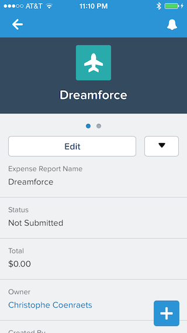

    > If you get a message indicating that "The page you are trying to access is not available on mobile devices", 
close the Salesforce1 Mobile App and restart it. This will only happen once and it will only happen during development.

1. Tap the menu icon  (upper left corner)
 
1. In the menu, tap **Expenses** under **Recent**
 
1. Tap **New** and add a couple of expenses for the expense report you just created
 
1. Go back to the expense report details view and notice that the Total field includes the new expenses

    > If the total has not been updated pull (swipe down and release) the view to refresh it.

1. Swipe left and notice that the **Expenses** related list automatically appears 

    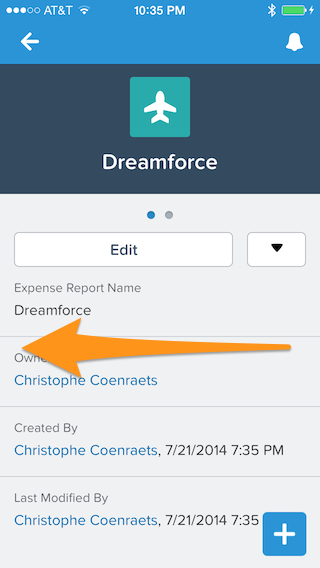
    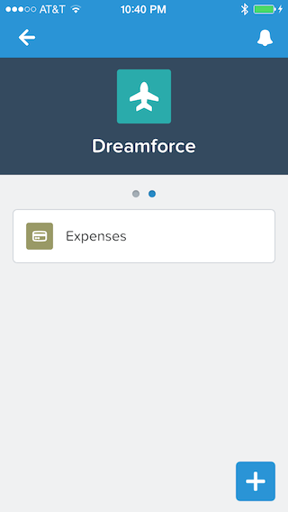

1. Tap the **Expenses** related list to display the list of expenses for that expense report

    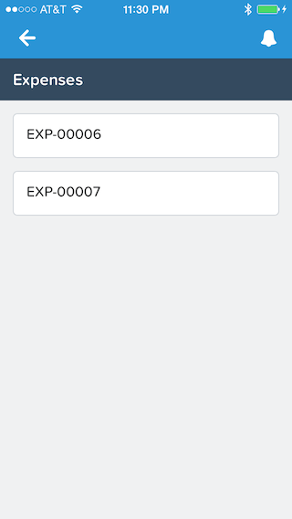
    
    > If the list is empty, pull it (swipe down and release) to refresh it.

1. Tap an expense to see the details

## Step 6: Pin Expense Reports at the Top of the List

For faster access, you can pin frequently used items at the top of the **Recent** menu item: you will no longer need 
to go find an object deep under the **More...** item.  

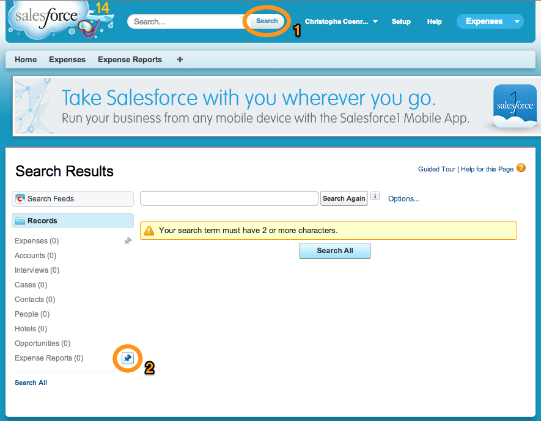

1. In the full Salesforce.com app, click the Search button in the header

    > You don't need to type anything in the search box: we just need the Search Results by Records to appear in the 
    left navigation.  

1. In the **Search Results** (left navigation), mouse over **Expense Reports**, and click the Pin button

1. In the Salesforce1 Mobile App, tap the menu icon  (upper left corner)

1. If **Expense Reports** doesn't appear as the first item under **Recent**, pull (swipe down and release) the menu to 
refresh it

    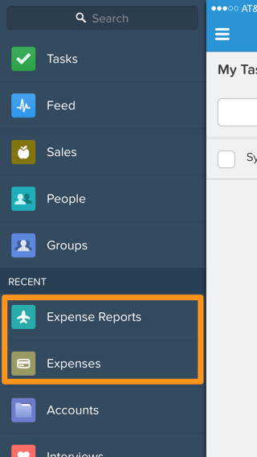

## Step 7: Modify the New Expense Global Action Layout

In a Master-Detail Relationship, every child record must have a parent. However, the **New Expense** Global Action 
Layout you created in [Module 9](create-global-action.html) does not include the **Expense Report** field to let the user specify 
the parent. To add the **Expense Report** field to the New Expense Global Action layout:

1. In **Setup** mode, select **Build** > **Create** > **Global Actions** > **Actions**

1. Click **Layout** to the left of **New Expense**

1. Drag the **Expense Report** field to the top of the layout and click **Save** 

    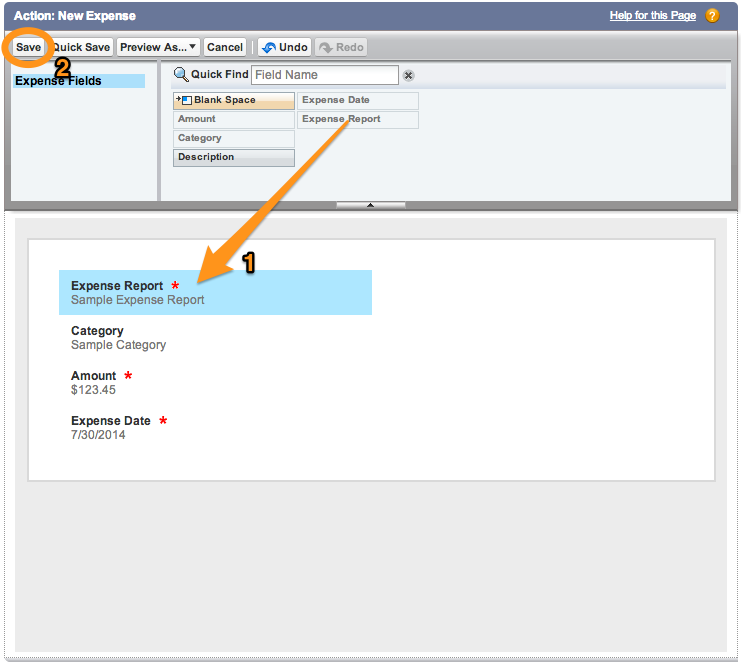

## Extra Credits

1. Using the instructions in [Module 6](create-mobile-layout.html) as a reference, 
create a Mobile Layout for the Expense Report object that 
only 
displays the information that mobile users really need

1. Using the instructions in [Module 7](create-compact-layout.html) as a reference, 
create a Compact Layout for the Expense Report object so that 
the 
record highlight area looks like this:

    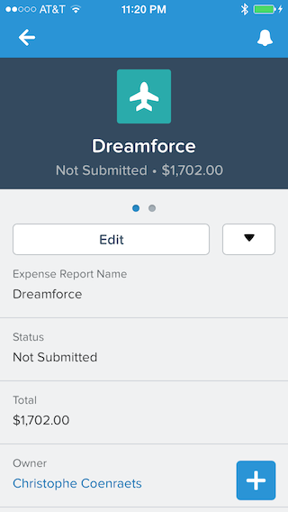

<a href="create-global-action.html" class="btn btn-default"><i class="glyphicon glyphicon-chevron-left"></i> Previous</a>
<a href="object-action-create-record.html" class="btn btn-default pull-right">Next <i class="glyphicon glyphicon-chevron-right"></i></a>

